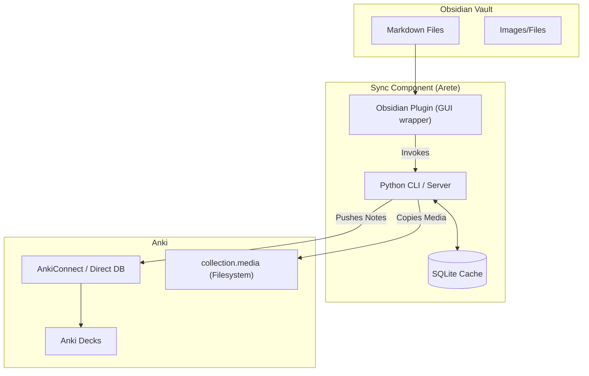

# Arete

**Pro-grade synchronization from Obsidian to Anki.**

[](https://github.com/Adanato/obsidian_2_anki/actions/workflows/ci.yml)
[](https://pypi.org/project/arete/)
[](https://github.com/Adanato/obsidian_2_anki/blob/main/LICENSE)

`arete` is a robust, fast, and feature-rich tool that adheres to a strict **One-Way Sync** philosophy: **Obsidian is the Source of Truth**.



---

## 📚 Documentation
- **[CLI Guide](./docs/cli_guide.md)**: Command-line usage, configuration, and syntax.
- **[Obsidian Plugin Guide](./docs/plugin_guide.md)**: Installation and usage of the Obsidian plugin.
- **[Architecture](./docs/ARCHITECTURE.md)**: Deep dive into how it works.
- **[Troubleshooting](./docs/troubleshooting.md)**: Common fixes for WSL, networking, and sync issues.

---

## Quick Start

### 1. Install CLI
`arete` requires [uv](https://github.com/astral-sh/uv) for dependency management.
```bash
git clone https://github.com/Adanato/obsidian_2_anki
cd obsidian_2_anki
uv sync
```

### 2. Install Plugin
Download the latest release from [Releases](https://github.com/Adanato/obsidian_2_anki/releases) and place them in `.obsidian/plugins/arete`.

### 3. Initialize & Sync
```bash
uv run arete init   # Set up your vault path
uv run arete sync   # First sync (will scan and link cards)
```

## Key Features
- ⚡ **Near-Instant Sync**: SQLite caching skips unchanged files.
- 📐 **Topological Sort**: Generate filtered decks that respect prerequisite dependencies.
- 🧬 **FSRS Support**: Native difficulty and retention analysis for modern schedulers.
- 🧹 **Prune Mode**: Automatically removes cards from Anki that you've deleted in Obsidian.
- 🩹 **Self-Healing**: Fixes duplicate IDs or broken links automatically.
- 📸 **Media Support**: Full synchronization of local images and attachments.
- 💻 **WSL Friendly**: Specialized bridge for Windows Subsystem for Linux users.

## Upgrading to v2.0
If you are coming from `o2a` or an older version of `arete`, run:
```bash
uv run arete migrate
```

## License
MIT
