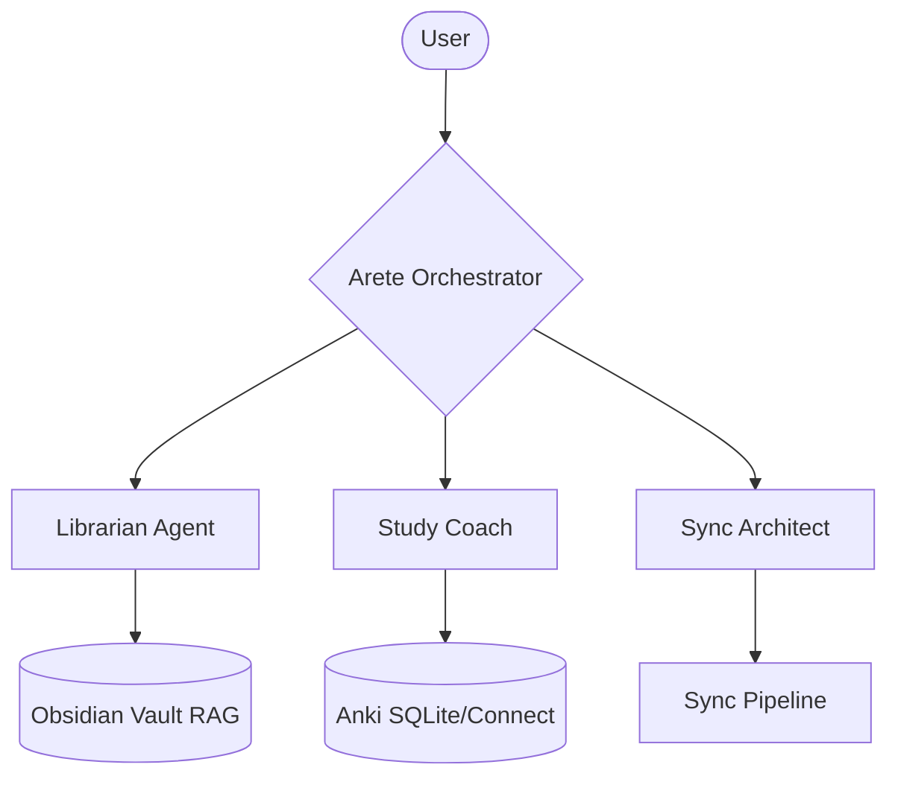

# Arete v2: Agentic Power Upgrade 🚀

To give Arete "more power," we need to move from a **Single-Turn Agent** (what we have now) to a **Multi-Agent Orchestration** system.

## 🏗️ The New Architecture

Instead of one agent trying to do everything, we split the brain into specialized roles.

### 1. The Orchestrator (The General)
- **Role**: Understands user intent and delegates to specialized agents.
- **Power**: It can plan multi-step missions. (e.g., "Find all my notes on 'Calculus', see which ones have high lapses in Anki, and suggest a rewrite").

### 2. The Librarian (The Context Expert)
- **Role**: Manages a local vector database (ChromaDB or similar).
- **Power**: True **Vault-wide RAG**. It can answer questions about notes that *aren't* synced yet.
- **Tool**: `search_vault(query)`, `get_related_notes(note_name)`.

### 3. The Study Coach (The Analyst)
- **Role**: Deep dives into Anki performance data.
- **Power**: Doesn't just show leeches; it analyzes *why* you are failing (e.g., "You tend to forget cards with more than 3 bullet points").

### 4. The Sync Architect (The Executor)
- **Role**: Manages the actual creation and update of cards.
- **Power**: Autonomous self-correction. If a field mapping is wrong, it can suggest a fix to the YAML metadata automatically.

---

## 🛠️ Technology Shift

| Feature | Current (v1.3) | v2 "Power" Upgrade |
| :--- | :--- | :--- |
| **Logic** | 2-step ReAct loop in `server.py` | Stateful State Machine (LangGraph style) |
| **Tools** | Manual JSON strings | Native LLM Tool Calling (Parallel) |
| **Context** | Leeches only | Full Vault Indexing (Local Embeddings) |
| **Memory** | Session-only | Persistent Memory (Last 10 study sessions) |

## 🌟 Advanced Inspirations (from Atomic Agents Ecosystem)

| Feature | Inspiration | Goal for Arete |
| :--- | :--- | :--- |
| **Hooks System** | `AtomicAgentHook` | Add automatic retries and sync performance metrics to the background server. |
| **Multimodal** | `GPT-4 Vision` | Allow Arete to "see" diagrams in notes to generate automatic image-occlusion cards. |
| **Orchestrator** | `ToolInterfaceAgent` | Move from 2-step ReAct to a native Union-based tool routing for faster responses. |
| **Deep Research** | `Long-form Chain` | Enable a "Knowledge Gap Analysis" that scans your entire vault for missing definitions. |

## 🎯 Next Steps for Power
1. **Move to Native Tool Calling**: Stop manually parsing "action: get_stats". Let the model call Python functions directly.
2. **Implement the Librarian**: Add a "Scan Vault" tool that lets the agent read any file it wants.
3. **Performance Hooks**: Use the hooks system to ensure that if a sync fails due to a locked DB, it retries intelligently.
